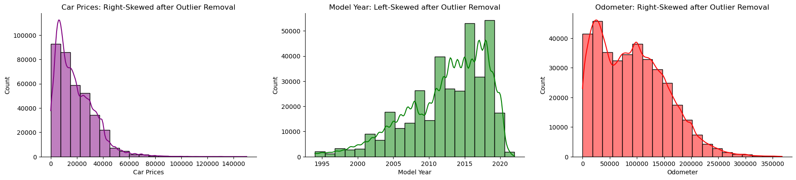
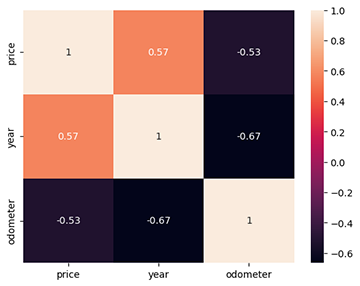
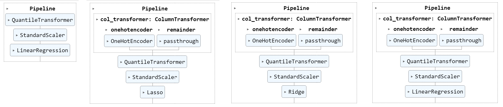
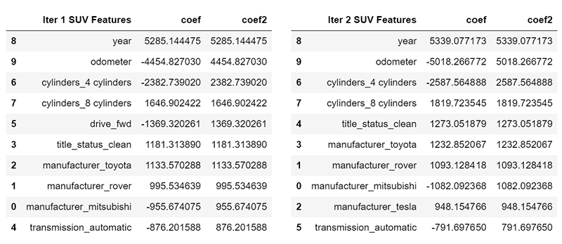

# What drives the price of a car?

The original dataset contained information on 3 million used cars. The practice dataset contains information on 426K cars to ensure speed of processing. The objective of this project is to determine what factors make a car more or less expensive. After detailed analysis, a clear recommendation is provided to the client -- a used car dealership -- as to what consumers value in a used car.

# Business Understanding

A car dealership works on the basis that they can buy cars for less than they are sold for. Therefore, prediction of the final sale price of the car is very important. Other than the profit, the demand of the car is also important for faster inventory turnover. Demand of the car depends on many factors but mostly the drivers' demographic and preferences are key elements. 

# Jupyter Notebooks

The first [Jupyter Notebook](data/first.ipynb) here provides the first cycle going through the CRISP-DM Process Model. After the first findings and insights, it was necessary to go back to the begining and reapeat the process as it will be explained below shortly. The additional notebooks can be found on here: [SUV NoteBook](data/iteration_suv.ipynb), [Sedan NoteBook](data/iteration_sedan.ipynb), and [Pickup NoteBook](data/iteration_pickup.ipynb).

# Exploratory Data Analysis and Data Cleaning

The provided dataset contains 426880 records and 18 features. The dataset is not clean and has a lot of missing values and garbage advertisement. The "model" column contains ads with bogus prices for the cars with phrases like: SPECIAL FINANCE PROGRAM 2020, Flexible Down Payments, BUY HERE PAY HERE, THE VEHICLE YOU DESERVE, any and all, Janesville, and etc. Fortunately, these rows have empty/null "manufacturer" values, so they will be dropped automatically in data-cleaning. Lastly, the type of most feature columns needs a transformation. 

First, domain knowledge of the car suggests that "VIN" and "id" columns should be dropped since they are just unique identifications. Since we also have the "state" column, "region" can be dropped completely. As mentioned on EDA section, "model" column can be dropped as well since it provides no extra information for the data. It was also decided to drop rows that have both missing "manufacturer" and "year," or where the "price" was zero, because these are information critical to the model. Here is a summary of missing values:

- size            %71.77
- cylinders       %41.62
- condition       %40.79
- VIN             %37.73
- drive           %30.59
- paint_color     %30.50
- type            %21.75
- manufacturer     %4.13
- title_status     %1.93
- model            %1.24
- odometer         %1.03
- fuel             %0.71
- transmission     %0.60
- year             %0.28

The rest of the columns needed to be transformed into appropriate datatypes, and missing values were filled with appropriate strings. After doing these, the missing value reduced to %3.8 in "manufacturer," and %0.56 for "odometer," where ".dropna()" where used for them. There was no duplicated data, and total rows after data-cleaning was reduced to 375619 with 14 features.

After plotting the histogram of the data, it was revealed that price is highly right-skewed with extreme outliers, year was left-skewed, and odometer was right-skewed. To remove price outliers, mean and standard deviation were calculated as $83,781 and $12,983,817 respectively, which shows the highly unusual right skew by $13M. It was decided to drop prices above $150K. For the year column, mean and std were calculated and records between [mean-2\*std] and [mean+2\*std] were kept. For the odometer column, records above [mean+2\*std] were removed. 

The numerical columns have high correlations, namely, price and year at 0.57, and price and odometer at -0.53. However, we can also see that odometer and year are highly correlated at -0.67.

# Building ML Models:

Before building any model, the data has to be transformed, normalized, and scaled properly. Therefore, a pipeline is chosen to facilitate with the model building process. The first step in the pipeline is to transform the categorical data using OneHotEncoder. The second step is to normalize the data with QuantileTransformer, and then using StandardScalar to scale the data. Based on future models, and finally the regression model.

First machine learning model to be built is a simple regression model with all categorical columns removed to be used as a baseline for evaluating other models. This pipeline has no transformer and no feature selector since there are no categorical data. The next 3 pipelines will all have the column transformer to transform the categorical data, and use Lasso, Ridge, and LinearRegression as their regression models.

# Evaluation

The baseline linear model returned RMSE score of 11590 and 11574 on Training and Test data respectively, while Lasso (with alpha set to 0.5) returned 8676 and 8637, Ridge (alpha=0.5) returned 8685 and 8647, and LinearRegression returned 8679 and 8641. The scores of all 3 models are very close and almost align completely as seen in charts below even when zoomed in. They also have performances better than the baseline. 

A pipeline with Lasso as automatic feature selection with RMSE of 9340 and 9302 for Train and Test data revealed 10 features as the most important ones: ferrari, fuel_diesel, title_status_clean, drive_fwd, drive_unknown_drive, type_pickup, cylinders_4 cylinders, cylinders_8 cylinders, year, and odometer. 

## Grid Search CV
Running a GridSearchCV pipeline shown below with Lasso automatic features selection of 4 to 10 features reveals a similar result. Looking at the coefficients of the regression model reveals that having newer model year, lower odometer, and clean title are the best general features for any vehicle on the market. However, penalized 4 cylinders and front wheel drive (fwd) in these models suggests that we need a completely different approach of business understanding of the car dealership needs. According to CRISP-DM Process Model, we have to go back to the beginning and rethink the process. Looking at the type column shows that SUVs, Sedans, and Pickups are the most dominant features. To create better ML models, it was decided to separate the data into these three categories, and run the pipelines on each segment separately. In their data cleaning process, it was decided to only truncate model years from the left side and keep all the recent years. 

## SUVs

The Jupyter notebook for this iteration can be found in [SUV NoteBook](data/iteration_suv.ipynb). All three pipelines of Lasso, Ridge, and LR had significantly better scores around 8142 and 8350 for Train and Test data. First iteration of sorted 10-features revealed: year, odometer, 4 cylinders, 8 cylinders, drive_fwd, title_status_clean, toyota, rover, mitsubishi, transmission_automatic. Second iteration was performed by removing the fwd drivetrain and resulted in: year, odometer, 4 cylinders, 8 cylinders, title_status_clean, toyota, rover, mitsubishi, tesla, and transmission_automatic. While Year and Odometer are still the most dominant features, the negative coef of 4 cylinders suggest that buyers in the SUV market prefer more powerful cars, preferably a clean titled Toyota, Rover, or Tesla, and definitely not a Mitsubishi.

## Sedans

The Jupyter notebook for this iteration can be found in [Sedan NoteBook](data/iteration_sedan.ipynb). All models in sedan dataset performed significantly better with RMSE errors of 5878 and 5856 for Train and Test data. First sorted 10-features revealed: year, odometer, transmission_other, drive_fwd, tesla, audi, lexus, mercedes-benz, 8 cylinders, and bmw. Again, in second iteration fwd was removed and we got: year, odometer, condition_good, 8 cylinders, tesla, audi, mercedes-benz, porsche, lexus, and title_status_clean. We still see the dominance of more powerful engine, but in this market section it is probably because these cars are cheaper and more people are buying them. A good condition also shows that these buyers buying older cars look at the condition of the car.

## Pickups

The Jupyter notebook for this iteration can be found in [Pickup NoteBook](data/iteration_pickup.ipynb). As seen on the image below, pickup customers have completely different preference than SUVs and Sedans, focusing in diesel fuel 4-wheel-drive drivetrain, clean title, and 8 cylinders. We also see in the first iteration that Nissan had a negative coef. In second iteration, only 4WD pickups where selected, and results are even more interesting. Now, having excellent condition is important, and California, Arizona, and Oregon show more interest. We can also immediately see that 4-cylinder pickups are not sought after.

# Deployment

The general price of a car depends on newer model year, lower odometer readings, and a clean title status. However, the prediction of price becomes more complicated when the different types of vehicles and features are considered. For the purpose of this report and the limited provided dataset, the vehicles are further divided into three categories of SUVs, Sedans, and Pickups. 

For SUV market in addition to the general features mentioned above, focus on Toyota, Rover, or Tesla, and avoid Mitsubishi and 4-cylinder SUVs. Of course, this decision is based on the provided dataset, and government incentives for electric cars and other changing situation needs to be considered. For sedan category, either focus on good condition and cheaper cars that usually have higher cylinders, or, focus on luxury cars like BMW, Audi, Mercedes, Porsche, and Lexus. For pickup vehicles, focus on 4WD and more powerful diesel engines and avoid Nissan and 4-cylinder engines. Pickups have better sales in California, Arizona, and Oregon.
